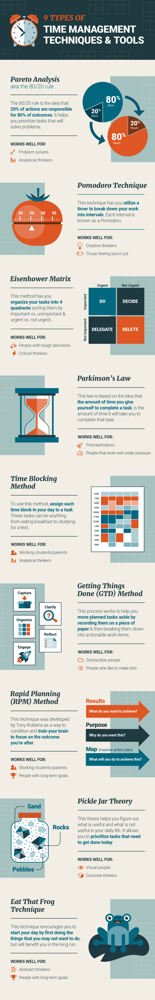
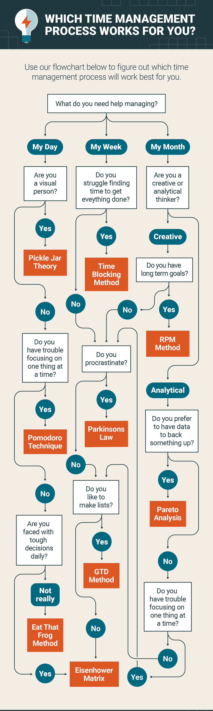

# Types of Time Management Techniques

Achieving work life balance is possible with effective time management. Learning time management tips will not only help you manage your time better but also boost personal productivity. With that said, here are some time management strategies you can try:

## 1. **Pareto Analysis (a.k.a., the 80/20 rule)**
The 80/20 rule is a technique created by the Italian economist Vilfredo Pareto. It’s the idea that 20% of actions are responsible for 80% of outcomes. The goal of Pareto analysis is to help you prioritize tasks that are most effective at solving problems.

  #### How it works:

- **List some of the problems you are facing**. For example, maybe your grades are slipping.

- **Identify the root cause of each problem**. Maybe your grades are slipping because you spend too much time on social media or any other sort of distraction.

- **Assign a score to each problem**: Assign higher numbers to more important problems 

- **Group problems together by cause**: Group together all the problems caused by spending too much time on social media. 

- **Add up the score of each group**: The group with the highest score is the issue you should work on first. 

- **Take action**.

#### Types of people who will benefit from Pareto Analysis:

- Problem solvers
- Analytical thinkers

## 2. **Pomodoro Technique**

The Pomodoro Technique was created by entrepreneur and author Francesco Cirillo. This technique uses a timer to break down your work into intervals. Each interval is known as a Pomodoro, named after the tomato-shaped timer that Cirillo created. 

#### How it works:

- **Choose a task you need to get done**. 

- **Set a timer** (e.g., for 25 mins).

- **Focus on the task at hand**.

- **When the timer rings, put a checkmark on a piece of paper**.

- **Take a short break**: Take a break for about three to five minutes. Go for a walk, grab a cup of coffee, do something non-work-related to give your brain a break.

- **Repeat steps two to five**: Once you have completed this process four times, you can begin to take longer breaks (20–30 mins).

#### Types of people that will benefit from the Pomodoro Technique:

- Creative thinkers
- Those who feel burnt out from work/school

The Pomodoro technique doesn’t just teach your time management; it also teaches you in setting goals and how to achieve them. You’ll be able to better stick to your daily schedule and weekly schedule.

## 3. **Eisenhower Matrix**

Before Dwight Eisenhower became president in 1953, he served in the U.S. Army as an Allied Forces Commander during World War II. He was faced with difficult decisions every day that led him to invent what is now called the Eisenhower matrix, or the urgent-important matrix.

#### How it works:

Organize your task list into four separate quadrants, sorting them by important vs. unimportant and urgent vs. not urgent, as shown in the graphic below. 
Urgent tasks are those we feel need to get done immediately. Important tasks are those that contribute to your long term goals or values. 
Ideally, you should only work on tasks in the top two quadrants—the other tasks, you should delegate or delete.

#### Types of people who will benefit from the Eisenhower Matrix:

- People in leadership positions
- Critical thinkers

## 4. **Parkinson’s Law**

British historian Cyril Northcote Parkinson became famous for the phrase “work expands so as to fill the time available for its completion.” In other words, the amount of time you give yourself to complete a specific task is the amount of time it will take you to complete that task.

#### How it works:

This is not a time management technique per se. It’s a law that, when understood, can be applied as one of the most beneficial time management methods out there—but you will have to put in the work. That means working more efficiently in shorter bursts of time. Here are some time management tips:

- **Try working without a computer charger**. This will force you to finish a project before your computer dies. 

- **Get it done early**. Instead of finishing an essay by midnight, try to get it done by noon. 

- **Set a deadline**. Give yourself a set time to do something—and then cut it in half.

- **Limit time for tasks**. Give yourself only 20 minutes in the morning to answer emails.

#### Types of people this works for:

- Procrastinators
- People who work well under pressure

## 5. **Time Blocking Method**

Inventor Elon Musk is known for being productive. He manages his time so efficiently that he can work over 80 hours a week and still make time for himself. What’s his secret? Time blocking.

#### How it works:

From the moment you wake up, assign each time block in your day to a task. These tasks can be anything from eating breakfast to studying for a test. Below are the steps Elon Musk uses to block his time: 

- Divide a piece of paper into two columns. On the left, write down each hour of the day and create blocks of time such as half-hour or hour chunks. 
- Estimate the time it’s going to take to complete each of your tasks and fit them into your time blocks. 
- Add buffer times in between each time block to allow for adjustments during the day.

#### Types of people this works for:

- Working students or parents
- Analytical thinkers

## 6. **Getting Things Done (GTD) Method**
Created by author David Allen, this process helps you get things done by recording tasks on paper and then breaking them down into actionable work items.

#### How it works:

- **Capture the actions that have your attention**: These actions are tasks that can relate to anything from work to school to your personal life. 

- **Clarify what they mean**: Decide whether the tasks that have your attention are actionable or not. If an item is not actionable, ignore it for now. If the item is actionable, do it, delegate it, or set it aside. 

- **Organize your actions**: Prioritize your to do list according to what you need to get done when.

- **Reflect**: Review your list of actions frequently to determine your next priority. Cross off tasks you have accomplished and update your list.

- **Engage**: Take the actions or smaller tasks you can complete right now.

#### Types of people who will benefit from the GTD method:

- People who struggle to focus on one thing at a time
- People who feel overwhelmed in their daily lives

## 7. Rapid Planning Method (RPM)
“RPM” stands for “rapid planning method” or “result, purpose, and massive action plan.” It was developed by motivational speaker Tony Robbins as a way to train your brain to focus on a vision of what you want so you can make it real.

#### How it works:

- **Capturing**: Write down all the tasks you need to accomplish this week. 

- **Chunking**: “Chunk” your tasks together by commonalities. Which items are personal? School-related? Career-focused?

- **Create your own RPM blocks**: On the top of a new sheet of paper, make three columns: the task, the result you want from completing that task, and your purpose for completing it. Next, list the actions you can take to get there.
- **Create an empowering role for yourself**: If you’re a student, you might call yourself the “Study Queen.” Anything that will get you jazzed about completing your goal.

#### Types of people who will benefit from the RPM:

- Working students or parents
- People who have long-term goals

## 8. **Pickle Jar Theory**

This theory helps you figure out what is useful and what is not useful in your daily life. It allows you to plan tasks with time to spare and set priorities for your day.

#### How it works:

Imagine a pickle jar full of sand, pebbles, and rocks. The sand is at the bottom and the rocks sit at the top.  

- **The sand**: This represents disrupting elements of your day, such as phone calls, text messages, emails, social media, etc.

- **The pebbles**: This represents tasks that need to be completed, but can be done on another day or by someone else.

- **The rocks**: These are the most important tasks that need to get done today.

Begin by thinking about how your tasks for the day would fit into the above categories. Then make a task list starting with the rocks and ending with sand (if time permits). Include an honest time estimate next to each. Try not to plan more than six hours of an eight-hour working day. This will leave buffer time for the pebbles and sand.

#### Types of people who will benefit from the Pickle Jar theory:

- Visual people
- Concrete thinkers

## 9. **Eat That Frog Technique**

This technique is named after a Mark Twain quote: “Eat a live frog the first thing in the morning and nothing worse will happen to you the rest of the day.” Start your day by doing the most onerous tasks first and getting them out of the way.

#### How it works:

- **Get clear on a goal. What do you want to achieve most?** 

- **Write it down**. 

- **Set a deadline**.  

- **Compile a list** of things you need to do to achieve your goal. 

- **Organize this list in order of priority**. The most important items are probably the most difficult. These are your “frogs.”  

- **Take action**. If you have more than one frog on your plate, eat the nastiest one first.

- **Repeat this cycle every day so that you’re always doing something that will push you toward your goal**.

#### Types of people who will benefit from the Eat That Frog technique:

- Abstract thinkers
- People with long-term goals

    

### Techniques Diagram

### Flowchart

Which technique works best for you according to your needs?

